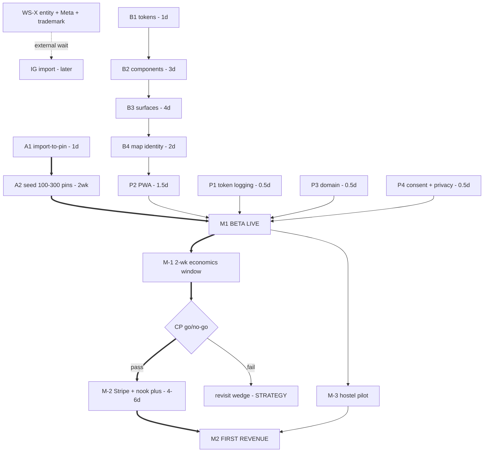

# nook — Development Plan

> **What this document is:** the single source of truth for what gets built next, in what
> order, and how we know it's done. Forward-looking only — the current state lives in
> [PROJECT_STATUS.md](PROJECT_STATUS.md), the business rationale in [STRATEGY.md](STRATEGY.md).
>
> **How to maintain it:** every workstream item has a `Status` cell —
> `⬜` todo · `🟡` doing · `⛔` blocked · `✅ YYYY-MM-DD` done.
> Update the cell when state changes; run **`npm run plan`** for a live dashboard
> (progress, M1 readiness, next unblocked items — parsed straight from this file, so there
> is no second task list to drift). When priorities change, edit the plan — never work from
> memory of an old version. Historical planning docs (`ROADMAP.md`,
> `TODO_FIXES_AND_NEW_FEATURES.md`, `MASTER_PLAN.md`) are archived; do not work from them.
>
> **Plan date:** 2026-07-14 · horizon: ~10 weeks to first revenue.

---

## 1. Milestones

| Milestone | Definition | Target |
|---|---|---|
| **M1 — Beta live** | Public, free-tier-only launch: seeded map, coherent design, PWA installable, legal complete | ~4 weeks from plan date |
| **CP — Checkpoint** | Go/no-go review of beta traction | M1 + 4 weeks |
| **M2 — First revenue** | nook+ tier live on measured economics; first paying sub or hostel | ~2–3 weeks after CP |

**M1 launch checklist** (all must be true):
- [ ] Every workstream item marked `M1` below is done
- [ ] Playwright smoke suite green against the production URL
- [ ] Map is non-empty in every launch city (see WS-A)
- [ ] Free-tier caps enforced **server-side** (rate limiter already does this — verify limits match STRATEGY §tiers)
- [ ] Token-usage logging live, so the economics window starts on day one

**CP go/no-go criteria** (measured over beta weeks 3–4):
- Weekly actives ≥ 50 **and** D7 retention ≥ 10% → proceed to M2
- Below either bar → **stop building, revisit the wedge** (STRATEGY §1) before spending
  anything on monetization or outreach

---

## 2. Workstreams

Effort is focused solo-dev time. Items marked **M1** block the beta milestone.
Every item has a **Done when** — if it can't be checked, it isn't done.

### WS-X · External clocks — *start today; they tick while you build*

| ID | Status | Item | Effort | Depends on | Done when |
|---|---|---|---|---|---|
| X1 | ⬜ | Register business entity (impresa innovativa) | admin | — | Entity exists with VAT number |
| X2 | ⬜ | Apply for Meta `oembed_read` (Instagram import) | admin | X1 | Application submitted; reviewed weekly |
| X3 | ⬜ | EUIPO check + trademark decision for "nook" | admin | — | Search done, register/rename decided |

### WS-A · Content — **the critical path** 🔴

| ID | Status | Item | Effort | Depends on | Done when |
|---|---|---|---|---|---|
| A1 **M1** | ✅ 2026-07-14 | Publish import as public pin: on import confirm, offer "also share as a public pin" → existing `createPin` with attribution (source URL + author) | 1 day | — | An imported place can become a public pin in one tap, with attribution rendered in the popup |
| A2 **M1** | ⬜ | Seed 100–300 pins across launch cities (Lisbon, Porto, Barcelona, Berlin, Prague, Split, Kraków, Naples — trim to 5 if needed) | 1–2 weeks, not code | A1 | Every launch city shows ≥ 20 quality pins in its default viewport |

> A1 is unblocked **today** and starts the seeding clock — the project's longest pole.
> Nothing in WS-B is allowed to delay it.

### WS-B · Design coherence — *parallel with WS-A*

| ID | Status | Item | Effort | Depends on | Done when |
|---|---|---|---|---|---|
| B1 **M1** | ✅ 2026-07-14 | Design tokens: fill `tailwind.config.cjs` theme (brand/dusk/peach/lace scales, semantic surface/ink/muted, radii, shadows, font) + CI grep banning raw hex outside the config and `PinLayer.tsx` GL expressions | 1 day | — | Config populated; CI fails on new raw hex; existing violations inventoried |
| B2 **M1** | ⬜ | Component library `src/components/ui/`: Button, Card, Modal, Input/Textarea/Select, Pill, EmptyState, Avatar (hand-rolled, ~40 lines each — **not** shadcn) | 3 days | B1 | All 7 exist with variants; Modal consolidates the 6 hand-rolled dialogs' Escape/backdrop/focus handling |
| B3 **M1** | ⬜ | Surface migration in first-impression order: map (MapView/PinPopup/FilterBar) → itinerary → profile → feed/notifications | 4 days | B2 | Zero legacy-palette classes (`#0066cc`, `#2563eb`, `#ff8c00`) remain in migrated surfaces |
| B4 **M1** | ⬜ | Visual identity: custom Mapbox Studio style in nook palette · custom pin mark from `NOOK-03.svg` · typeface + type scale · pin-drop/popup/fly-to motion | 2 days | B1 | Map renders the custom style; new pin mark in place; font loaded with fallback |

### WS-P · Platform & launch — *after WS-B, before M1*

| ID | Status | Item | Effort | Depends on | Done when |
|---|---|---|---|---|---|
| P1 **M1** | 🟡 | Token-usage logging: log `usage` from every LLM response in `api/lib/llm.ts` (3-line change) + cache hit/miss counter | ½ day | — | Every generation logs tokens in/out + cache status, queryable in Vercel logs |
| P2 **M1** | ⬜ | PWA shell: manifest, icons from `NOOK-03.svg`, service worker (offline shell + map-tile cache), iOS meta tags, install prompt | 1½ days | B4 | Lighthouse PWA installable pass; add-to-home-screen works on iOS + Android |
| P3 **M1** | ⬜ | Custom domain + HTTPS on Vercel | ½ day | — | App serves on the real domain; `ALLOWED_ORIGINS` updated |
| P4 **M1** | ⬜ | Cookie consent banner + privacy-policy update adding `saved_places` (location-intent data) to the GDPR data inventory | ½ day | — | Consent gate live defaulting to decline-non-essential; policy names saved_places |
| P5 | ⬜ | Perf pass: code-split `mapbox-gl` out of the main bundle; memoize Supercluster index; Lighthouse before/after | 1 day | — | Initial JS bundle measurably smaller; no map-interaction regression |

### WS-M · Monetization — **gated on M1 + CP; do not start early**

| ID | Status | Item | Effort | Depends on | Done when |
|---|---|---|---|---|---|
| M-1 | ⬜ | Unit economics from real traffic: 2-week data window post-M1; fill the STRATEGY §economics table | 2 wks elapsed, ~0 dev | P1 + beta live | Table filled from logs, not guesses; €/active-user known |
| M-2 | ⬜ | Stripe + nook+ tier: server-side metering of free caps, paywall UI, webhooks, **VAT OSS registration** (Italian entity, EU-wide consumer sales) | 4–6 days + admin | M-1, X1 + CP passed | A real card can subscribe; caps lift on payment; VAT handled |
| M-3 | ⬜ | Hostel pilot: list 20 hostels in seed cities → one-page pitch backed by "N travelers saved places near you" data → 10 free pilot accounts | ongoing | A2 + beta live | 10 pilots onboarded; feedback loop running |

### WS-L · Later / explicitly deferred

| Item | Revisit when |
|---|---|
| Instagram import (Tier 1 via `oembed_read`) | X2 approval arrives |
| Tier 2 social extraction (OCR/audio) — legal review first | Tier 1 hit-rate data says it's needed |
| Unify `pin_bookmarks` remnants (drop `bookmark_count` column + trigger) | Next schema migration touching `pins` |
| Public "saved by N travelers" count fed by `saved_places.pin_id` | Hostel pitch needs it (M-3) |
| Native app shell (Expo wrap) | PWA metrics show install friction |
| Remove `zustand` dep; icon-library decision | Next dependency pass (fold into B2) |
| Pin flicker on map (user-reported, pre-dates redesign) | B4 — may vanish with the new map style; re-test then |

---

## 3. Sequence

### Week-by-week

| Week | Focus |
|---|---|
| **1** | Day 1: X1/X2/X3 paperwork filed + **A1** shipped. Day 2: B1 tokens + P1 logging. Days 3–5: B2 components. **Seeding starts day 2** and runs continuously. |
| **2** | B3 surface migration. Seeding continues. |
| **3** | B4 visual identity → P2 PWA → P3 domain → P4 consent. Seeding continues. |
| **4** | Buffer + launch checklist + P5 perf if time allows → **M1 beta live.** |
| **5–8** | Beta iteration on user feedback; M-1 data accrues; M-3 hostel pitch prep with real data. Week 8: **CP go/no-go.** |
| **9–10** | If CP passes: M-2 Stripe + nook+ → **M2 first revenue.** |

Total: **~16 focused dev days** to M1 inside 4 calendar weeks (seeding is the constraint,
not code), then traction-gated monetization.

---

## 4. Risk register

| # | Risk | L×I | Mitigation |
|---|---|---|---|
| 1 | **Empty map at launch** — user lands on blank viewport, churns in seconds | H×H | A1 makes users seed for you; A2 manual floor of 20 pins/city; MapEmptyState CTA already ships |
| 2 | **Instagram gap** — wedge feature missing on the #1 platform for this demographic | H×M | X1→X2 filed week 1 (weeks of external lead time); TikTok/Pinterest carry launch; measure demand via failed-IG-paste attempts (add a counter) |
| 3 | **Visual incoherence** — three palettes read as "unfinished side project" to users, hostels, investors | M×H | Entire WS-B is the mitigation; B1's CI grep prevents regression |
| 4 | **Solo-founder burnout / bus factor** — 281 commits in 4.5 months, intensity already tapering (120→2/month) | M×H | Plan capped at ~16 dev days to M1 with a buffer week; seeding is deliberately non-code recovery work; CP is an explicit permission point to stop |
| 5 | **Cost cliffs at scale** — OpenAI per-generation + Mapbox 50k free loads/month | L×H | P1 measures OpenAI from day one; Mapbox row in STRATEGY economics table; caps enforced server-side |
| 6 | **EU compliance on payments** — VAT OSS for consumer subs is real admin, not code | M×M | Scoped honestly into M-2 (4–6 days + admin); X1 entity is the prerequisite, filed week 1 |

---

## 5. Change log

| Date | Change |
|---|---|
| 2026-07-14 | Plan created — supersedes `MASTER_PLAN.md` §4 after dependency review (critical-path fix: A1 before design work; pricing moved after beta data; external clocks promoted into sequence) |
| 2026-07-14 | Added `Status` column to all workstream tables + `npm run plan` dashboard (`scripts/plan-status.mjs`) parsing this file directly |
