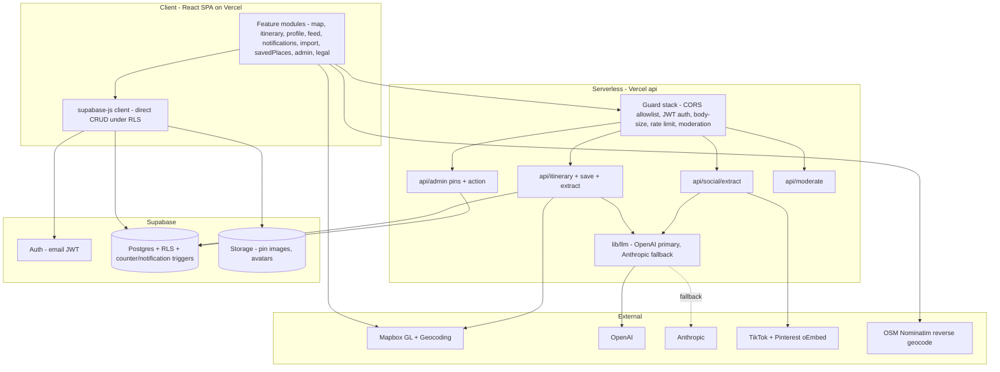

# nook — Project Status

> **What this document is:** a factual snapshot of what exists — architecture, features,
> data model, quality infrastructure, debt. No plans, no opinions.
> **Companions:** [DEVELOPMENT_PLAN.md](DEVELOPMENT_PLAN.md) (what to build next) ·
> [STRATEGY.md](STRATEGY.md) (why, and how it makes money).
>
> **Snapshot date:** 2026-07-14 · update this doc when a milestone in the plan completes.

---

## 1. What nook is

A community map + AI trip planner for backpackers (18–35, Europe). Three pillars, one loop:

1. **Community map** — user-dropped pins (food/nightlife/sights/…) with photos, tips,
   reactions, comments; separate traveler and hostel voices.
2. **AI itinerary planner** — streaming, wedge-tuned ("hidden corners over tourist traps"),
   grounded in community pins, weather, budget and transit context.
3. **Personal map ("My Map")** — a private want-to-visit list fed by social imports
   (TikTok/Pinterest links → geocoded places), saved community pins, itinerary venues,
   and manual drops; doubles as a travel log via a visited toggle.

The loop: *see a place on social → import it → it lands on My Map → plan a trip around it →
go → mark visited → publish it as a community pin for the next person.*

## 2. Vital statistics

| | |
|---|---|
| First commit | 2026-03-01 |
| Commits | 281 (monthly: 120 → 104 → 32 → 23 → 2) |
| Source size | ~11k LOC (`src/` ~7.5k + `api/` ~3.5k, TypeScript) |
| Contributors | 1 |
| Branches | `main` (production) · `dev` (integration) · `dev-*` feature branches |
| Deploy | Vercel (SPA + serverless functions), auto-deploy per push |
| Database | Supabase Postgres, 17 migrations applied |

## 3. Architecture



**Two data paths, by design:**
- **Client → Supabase directly** for all CRUD (pins, comments, follows, saved places, …),
  secured by RLS. No server roundtrip.
- **Client → Vercel serverless** only where a server is genuinely needed: LLM calls, oEmbed
  fetches, admin actions (service-role key), moderation. Every endpoint runs the same guard
  stack: CORS allowlist → `requireAuth` (JWT) → `validateBodySize` (100 KB) → per-user rate
  limit (Supabase-backed sliding window) → OpenAI moderation where user text is involved.

## 4. Codebase map

```
src/
  App.tsx                    Pathname-based router (no router dep), auth gate, lazy routes
  components/                Shared primitives: ConfirmDialog, PromptDialog, Skeleton,
                             FeatureErrorBoundary
  lib/                       supabaseClient, analytics, moderation, imageCompress,
                             imageTransforms, mapsUtils, mapbox (reverse geocode),
                             venueGeocoding, ensureProfile
  features/
    auth/                    AuthPage, InitialPage (home), LoadingPage
    map/                     MapView (composition root, 472 lines), MapCanvas, PinLayer
                             (Supercluster + GL layers), PinPopup, FilterBar, CompassButton,
                             MapEmptyState, lightbox, modals/ (Draft, MyMapDraft, TipsViewer,
                             DeleteConfirm), hooks/ (useMapPins, useIsMobile)
    pins/                    pinApi, pinTypes, commentsApi, PinComments
    itinerary/               ItineraryModal, ItineraryForm, ItineraryPreview, itineraryApi,
                             hooks/useItineraryDraft
    savedPlaces/             savedPlacesApi, useSavedPlaces          ← "My Map" data layer
    import/                  ImportFromLinkModal, socialImportApi    ← social URL import
    profile/                 profileModal + tabs/ (ProfileInfo, MyPlaces, SavedItineraries),
                             PublicProfilePage, publicProfileApi, followApi, handleValidation
    feed/                    FeedPage, feedApi                       ← followees' pins
    notifications/           NotificationsPage, notificationsApi    ← like/save/follow/comment
    admin/                   AdminPage, adminApi                     ← moderation dashboard
    legal/                   TermsPage, GuidelinesPage, PrivacyPage

api/
  itinerary.ts               Streaming generation (60s budget)
  itinerary/save.ts          Persist itinerary (30s)
  itinerary/extract.ts       Extract venues from itinerary markdown
  social/extract.ts          oEmbed → LLM place extraction → geocode (30s)
  moderate.ts                Client pre-flight moderation
  admin/{pins,action}.ts     Moderation queue + hide/restore/delete
  lib/                       llm (provider abstraction + fallback), prompts (wedge persona),
                             extractPlaces, socialFetch, travelContext, budgetContext,
                             practicalContext, weatherContext, placesContext (community pins
                             into prompts), geocodeCache, itineraryCache, rateLimit,
                             requireAuth, requireAdmin, cors, moderation, validateBodySize,
                             log (pino), sentryServer
```

## 5. Data model (Supabase)

| Table | Purpose | Access |
|---|---|---|
| `profiles` | User identity: role (traveler/hostel), handle, bio, avatar, counters | Public SELECT; self UPDATE |
| `pins` | Community pins + cached counters (comments, reports; `is_hidden`) | Public SELECT (minus hidden); owner CUD |
| `pin_reactions` | Like/dislike, one per user per pin | Owner CUD; counts via view |
| `pin_comments` | Threaded comments, 1–1000 chars | Public SELECT; owner CUD |
| `pin_reports` | Moderation reports; auto-hide trigger at threshold | Reporter INSERT |
| `pin_bookmarks` | **Dormant** — UI removed 2026-06; kept to avoid migration risk | — |
| `saved_places` | Personal My Map: title/note/category/coords/source/attribution/visited | **Owner-only, all ops** |
| `itineraries` | Saved AI itineraries, `is_public` opt-in | Owner + public-flagged SELECT |
| `itinerary_places` | Extracted venues per itinerary | Follows itineraries |
| `follows` | Social graph; counter triggers on profiles | Public SELECT; follower CUD |
| `notifications` | like/bookmark/follow/comment; written by SECURITY DEFINER triggers only | Recipient-only |
| `rate_limits` | Sliding-window API limiter | Server only |
| `caches` | Geocode + itinerary response cache | Server only |

## 6. Routes

| Route | Access | Renders |
|---|---|---|
| `/` | Public → auth gate | InitialPage (home) → MapView |
| `/terms` `/guidelines` `/privacy` | Public | Legal pages |
| `/u/:handle` | Public | PublicProfilePage |
| `/feed` `/notifications` | Signed-in | Feed, notification inbox |
| `/admin` | Admin flag | Moderation dashboard |

## 7. Quality infrastructure

| Layer | What exists |
|---|---|
| Type safety | `tsc -b` in build; strict TS across src+api |
| Lint | ESLint 9 flat config; husky + lint-staged pre-commit |
| Unit tests | Vitest — input validation, budget/travel context, extractPlaces parsing |
| E2E | Playwright smoke, 3 tiers (public / authed via env creds / expensive opt-in) |
| AI evals | `npm run eval` — trip-input rubric harness (venues real, geocodes, budget, banned vocab) |
| CI | GitHub Actions: lint + typecheck + Playwright; blocks merge |
| Logging | pino structured logs, request-id tagged (`api/lib/log.ts`) |
| Errors | Sentry (React + Node) |
| Analytics | Vercel Analytics + custom `track()` events (signup, pin_created, itinerary_generated + tripType, …) |
| Abuse | Rate limits per user per endpoint; OpenAI moderation on all user text; report → auto-hide; admin dashboard |

## 8. Known debt (open, tracked in the plan)

| Item | Severity | Where fixed |
|---|---|---|
| Zero design tokens — `tailwind.config.cjs` theme is empty; brand hexes hardcoded ~40×; 3 legacy palettes coexist | High | Plan WS-B / B1 |
| No PWA manifest, icons, or service worker (`public/` has only `vite.svg`) | High | Plan WS-P / P2 |
| `zustand` in dependencies, never imported | Low | Remove on next dep pass |
| `imgDetail` preset unused since BookmarkedPinsTab removal | Low | Kept deliberately (symmetric preset set) |
| `@phosphor-icons/react` used in exactly 1 file | Low | Fold into icon decision in WS-B |
| `mapbox-gl` (~800 KB gz) in the main bundle | Medium | Plan WS-P / P5 |

## 9. History at a glance

| Period | What happened |
|---|---|
| Mar 2026 | MVP built: auth, map, pins, itinerary AI, profile (120 commits) |
| Apr 2026 | ROADMAP phases 1–5: security (JWT, service-role, rate limits), giant-file refactor, Tailwind migration, viewport queries + clustering, moderation stack, community layer (public profiles, follows, feed, notifications, comments) |
| May 2026 | Observability + testing (Sentry, Playwright, CI, husky), product wedge (persona prompt, trip types), Figma-driven landing redesign |
| Jun 2026 | TODO part A (logging, evals, LLM fallback, caching, lazy routes, a11y), part B (TikTok/Pinterest import), part C (My Map personal layer; bookmarks removed in favor of ⭐) |
| Jul 2026 | Part C closed (itinerary→My Map, plan-from-saved-places), dead-code purge, MapView re-split, this documentation set |

Historical planning docs — [`ROADMAP.md`](../ROADMAP.md) and
[`TODO_FIXES_AND_NEW_FEATURES.md`](../TODO_FIXES_AND_NEW_FEATURES.md) — are **archived
references** (their checked items are the history above; their unchecked items were absorbed
into [DEVELOPMENT_PLAN.md](DEVELOPMENT_PLAN.md)). Don't work from them.
